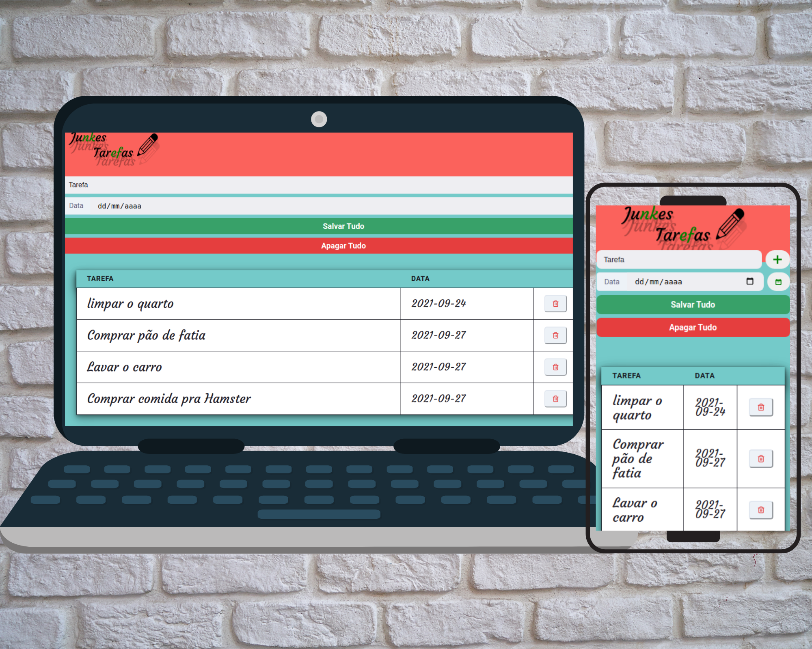
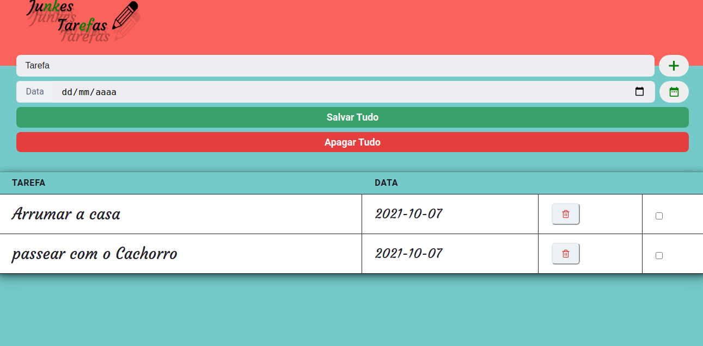
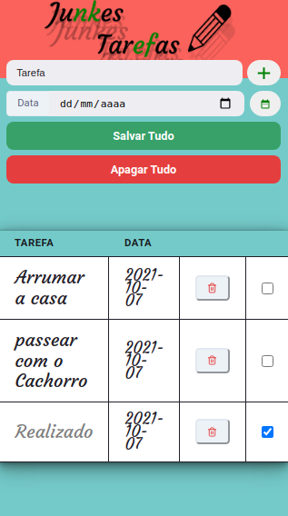

# Junkes Afazeres

## Preview 



### Faça o teste aqui => [Junkes Lista](https://junkes-lista.vercel.app/)




## Sobre

Uma lista de Afazeres, bem funcional, colocando em prática o que foi aprendido no curso RocketSeat(Ignite) 2021, basicamente adicione algo que tens para fazer no dia, escolha uma data(pode ser de prazo para concluir), tudo fica salvo no local storage, você pode adicionar tarefa, excluir tarefa, colocar como Realizado(última atualização).

## Instalação 

Clone o repositório com ```git clone https://github.com/Leojunkes/junkes_afazeres```

entre na pasta ```cd junkes_afazeres```

rode ```npm install```ou```yarn```para instalar as dependências.

e por fim rode ```yarn dev``` ou ```npm run dev```

abra http://localhost:3000 com seu browser.

## license

This project is licensed under the MIT License - see the LICENSE.md file for details.
